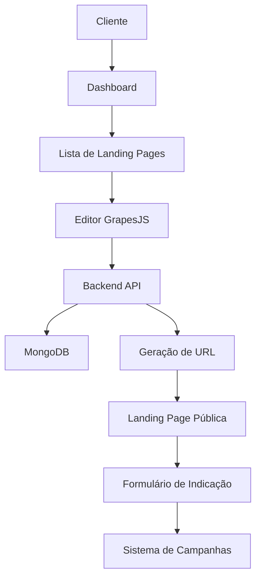

# 📝 Documentação do Editor GrapesJS - Landing Pages de Indicação

## 📋 Índice
1. [Visão Geral](#visão-geral)
2. [Estado Atual (Frontend)](#estado-atual-frontend)
3. [Funcionalidades Essenciais Implementadas](#funcionalidades-essenciais-implementadas)
4. [Arquitetura Proposta (Online)](#arquitetura-proposta-online)
5. [Fluxo de Dados](#fluxo-de-dados)
6. [APIs Necessárias](#apis-necessárias)
7. [Estrutura de Dados](#estrutura-de-dados)
8. [Funcionalidades Planejadas](#funcionalidades-planejadas)
9. [Próximos Passos](#próximos-passos)

---

## 🎯 Visão Geral

O **Editor GrapesJS** é uma ferramenta visual que permite aos clientes criarem landing pages personalizadas para campanhas de indicação sem conhecimento técnico. O sistema oferece uma interface drag-and-drop intuitiva com blocos pré-configurados específicos para indicações.

### Objetivos Principais
- Permitir criação de LPs sem conhecimento técnico
- Integrar com sistema de campanhas existente
- Gerar páginas otimizadas para conversão
- Facilitar personalização de marca
- Automatizar processo de publicação

---

## 🖥️ Estado Atual (Frontend)

### ✅ Implementado

#### **Interface do Editor**
```
📁 client/pages/lp-editor-grapes.html
├── Layout responsivo com painel lateral
├── Sistema de abas (Blocos/Estilos/Propriedades)
├── Canvas principal para edição
└── Toolbar com ações (Salvar/Voltar)
```

#### **Blocos Disponíveis**
1. **Hero Section** - Seção de destaque com gradiente
2. **Seção Padrão** - Container básico para conteúdo
3. **2 Colunas** - Layout flexbox responsivo
4. **Texto** - Parágrafos editáveis
5. **Título** - Cabeçalhos H1-H6
6. **Imagem** - Elementos visuais responsivos
7. **Botão** - Call-to-action customizável
8. **Formulário de Indicação** - Campos: Nome, Email, Telefone
9. **Lista de Benefícios** - Cards com ícones e descrições

#### **Funcionalidades Atuais**
- ✅ Drag & drop de blocos
- ✅ Edição inline de textos
- ✅ Customização de estilos (CSS)
- ✅ Preview responsivo (Desktop/Mobile)
- ✅ Sistema de abas inteligente
- ✅ Salvamento local (localStorage)
- ✅ Exportação HTML/CSS

#### **Armazenamento Atual**
```javascript
// localStorage (temporário)
{
  "grapesLPHtml": "<div>...</div>",
  "grapesLPCss": "body { ... }",
  "grapesLPCreatedAt": "2024-01-15 14:30:00"
}
```

---

## 🛠️ Funcionalidades Essenciais Implementadas

### ✅ **Container - Edição do Fundo, Cores e Espaçamento**

#### 🖼️ **Fundo & Cores (Setor Prioritário ⭐)**
- **background-color**: Cores sólidas de fundo com seletor visual
- **background-image**: Upload e configuração de imagens de fundo
- **background-size**: Controle do tamanho (cover, contain, auto, etc.)
- **background-repeat**: Repetição da imagem (repeat, no-repeat, etc.)
- **background-position**: Posicionamento preciso da imagem
- **background-attachment**: Comportamento no scroll (fixed, scroll)
- **background-blend-mode**: Efeitos de mistura de cores

#### 📦 **Container & Espaçamento (Setor Prioritário ⭐)**
- **Dimensões**: width, height, max-width, min-height
- **Espaçamento Externo**: margin com controles individuais (top, right, bottom, left)
- **Espaçamento Interno**: padding com controles individuais (top, right, bottom, left)
- **Box Model**: box-sizing para controle do modelo de cálculo

#### 🎯 **Ações Rápidas para Containers**
- **"Padding 20px"**: Aplica espaçamento interno padrão
- **"Centralizar"**: Centraliza o container (margin: 20px auto)
- **"Fundo Cinza"**: Aplica cor neutra (#f8f9fa)
- **"Fundo Azul"**: Aplica cor azul claro (#e3f2fd)
- **"Cantos Arredondados"**: Adiciona border-radius de 8px

### ✅ **Blocos - Funcionalidade de Espaçador**

#### 📏 **Bloco Espaçador Inteligente**
- **Funcionalidade Principal**: Adiciona espaçamento vertical entre elementos
- **Altura Padrão**: 50px com indicação visual
- **Edição Rápida**: Duplo-clique alterna entre tamanhos predefinidos:
  - 20px, 30px, 50px, 80px, 100px, 150px
- **Customização Avançada**: Campo numérico no painel Propriedades (10px a 500px)
- **Feedback Visual**: Bordas tracejadas, hover interativo, texto indicativo

#### 📐 **Blocos Complementares de Layout**
- **Linha Divisória**: Separador horizontal com gradiente elegante
- **Container Personalizado**: Container pré-estilizado para agrupamento

### ✅ **Edição de Fontes - Tamanho, Cor, Tipo de Fonte**

#### ✏️ **Fontes & Tipografia (Setor Prioritário ⭐)**
- **font-family**: Seleção de famílias de fontes do sistema e web fonts
- **font-size**: Tamanho da fonte com unidades flexíveis (px, em, rem, %)
- **font-weight**: Peso da fonte (normal, bold, 300, 400, 500, 600, 700, 800, 900)
- **font-style**: Estilo da fonte (normal, italic, oblique)
- **line-height**: Altura da linha para melhor legibilidade
- **letter-spacing**: Espaçamento entre letras (tracking)
- **color**: Cor do texto com seletor visual avançado
- **text-align**: Alinhamento (left, center, right, justify)
- **text-decoration**: Decorações (none, underline, line-through)
- **text-transform**: Transformações (none, uppercase, lowercase, capitalize)

#### 🎯 **Ações Rápidas para Textos**
- **"Bold"**: Aplica font-weight: bold
- **"Italic"**: Aplica font-style: italic
- **"Center"**: Centraliza o texto
- **"Azul"**: Cor azul (#3498db)
- **"Vermelho"**: Cor vermelha (#e74c3c)

#### ⌨️ **Atalhos de Teclado**
- **Ctrl+B**: Aplicar negrito ao elemento selecionado
- **Ctrl+I**: Aplicar itálico ao elemento selecionado
- **Ctrl+U**: Aplicar sublinhado ao elemento selecionado

### 🎨 **Interface Aprimorada**

#### 🎯 **Setores Organizados por Prioridade**
1. **📦 Container & Espaçamento** (Aberto por padrão ⭐)
2. **🖼️ Fundo & Cores** (Aberto por padrão ⭐)
3. **✏️ Fontes & Tipografia** (Aberto por padrão ⭐)
4. **📐 Posicionamento** (Fechado - position, z-index, visibility)
5. **🔄 Layout Flexível** (Fechado - flexbox e grid)
6. **🔲 Bordas & Efeitos** (Fechado - borders, shadows)
7. **✨ Transformações** (Fechado - transform, animations)

#### 🎨 **Sistema de Cores e Feedback Visual**
- **Cores de Destaque**: Cada setor essencial tem cor específica
  - **Azul (#2196f3)**: Container & Espaçamento
  - **Roxo (#9c27b0)**: Fundo & Cores  
  - **Laranja (#ff9800)**: Fontes & Tipografia
- **Indicadores Visuais**: Estrelas (⭐) nos setores prioritários
- **Propriedades Destacadas**: Bordas coloridas nas propriedades mais utilizadas
- **Estados Modificados**: Propriedades alteradas ficam destacadas em verde

#### 💡 **Dicas Contextuais Inteligentes**
- **Dicas por Tipo de Elemento**: Orientações específicas baseadas no elemento selecionado
- **Tooltips Informativos**: Explicações dos setores ao passar o mouse
- **Ações Rápidas Contextuais**: Botões específicos para cada tipo de elemento

### 🚀 **Guia de Uso Rápido**

#### **Para Containers (div, section):**
1. Selecione um elemento container
2. Use **"📦 Container & Espaçamento"** para dimensões e margens
3. Use **"🖼️ Fundo & Cores"** para backgrounds e cores
4. Use **"Ações Rápidas"** para aplicações instantâneas

#### **Para Textos (h1-h6, p, span):**
1. Selecione um elemento de texto
2. Use **"✏️ Fontes & Tipografia"** para personalização completa
3. Use **"Ações Rápidas"** para mudanças rápidas
4. Use **atalhos de teclado** para formatação instantânea

#### **Para Espaçamento:**
1. Arraste o bloco **"Espaçador"** da categoria "Layout"
2. **Duplo-clique** no espaçador para alterar tamanho rapidamente
3. Ou selecione e use o painel **"Propriedades"** para altura exata

#### **Para Botões:**
1. Selecione um elemento button
2. Use **"Ações Rápidas"** para cores predefinidas (Azul, Verde, Vermelho)
3. Use **"🔲 Bordas & Efeitos"** para border-radius e sombras

### 📊 **Melhorias de UX Implementadas**

- ✅ **Contraste Excelente**: Textos escuros (#2c3e50) em fundos claros
- ✅ **Navegação por Abas**: Sistema organizado de Blocos/Estilos/Propriedades
- ✅ **Estados Visuais**: Indicadores de conteúdo e elementos modificados
- ✅ **Responsividade**: Controles de dispositivo (Desktop/Mobile) no header
- ✅ **Scrollbar Customizada**: Visual moderno e consistente
- ✅ **Feedback de Seleção**: Bordas azuis destacam elementos selecionados
- ✅ **Auto-sugestões**: Sistema sugere aba relevante baseado no elemento

---

## 🏗️ Arquitetura Proposta (Online)

### **Fluxo Completo do Sistema**



### **Componentes da Arquitetura**

#### **1. Frontend (Client)**
```
📁 client/pages/
├── external-form.html          # Lista de LPs criadas
├── lp-editor-grapes.html       # Editor visual
└── lp-preview.html             # Preview da LP
```

#### **2. Backend (API)**
```
📁 server/src/landing-pages/
├── entities/
│   └── landing-page.schema.ts  # Schema MongoDB
├── dto/
│   ├── create-landing-page.dto.ts
│   └── update-landing-page.dto.ts
├── landing-pages.controller.ts # Endpoints REST
├── landing-pages.service.ts    # Lógica de negócio
└── landing-pages.module.ts     # Módulo NestJS
```

#### **3. Páginas Públicas**
```
📁 public/lp/
└── [slug]/                     # URLs amigáveis
    ├── index.html              # Landing page renderizada
    ├── assets/                 # Recursos estáticos
    └── form-handler.js         # JavaScript do formulário
```

---

## 🔄 Fluxo de Dados

### **1. Criação de Landing Page**

```javascript
// 1. Cliente cria LP no editor
const editorData = {
  html: editor.getHtml(),
  css: editor.getCss(),
  components: editor.getComponents()
};

// 2. Salva no backend
POST /api/landing-pages
{
  "name": "LP Campanha Verão 2024",
  "slug": "campanha-verao-2024",
  "clientId": "507f1f77bcf86cd799439011",
  "campaignId": "507f1f77bcf86cd799439012",
  "content": {
    "html": "<section>...</section>",
    "css": "body { margin: 0; }",
    "components": [...],
    "assets": ["image1.jpg", "icon.svg"]
  },
  "status": "draft",
  "seoSettings": {
    "title": "Indique e Ganhe - Campanha Verão",
    "description": "Participe da nossa campanha...",
    "keywords": ["indicação", "campanha", "verão"]
  }
}

// 3. Sistema gera URL pública
// https://meudominio.com/lp/campanha-verao-2024
```

### **2. Publicação e Acesso**

```javascript
// 1. Cliente publica LP
PATCH /api/landing-pages/:id
{
  "status": "published"
}

// 2. Sistema gera página estática
// 3. URL fica acessível publicamente
// 4. Formulários conectam com sistema de campanhas
```

### **3. Submissão de Indicação**

```javascript
// 1. Visitante preenche formulário na LP
POST /api/referrals/submit
{
  "campaignId": "507f1f77bcf86cd799439012",
  "landingPageId": "507f1f77bcf86cd799439013",
  "referralData": {
    "name": "João Silva",
    "email": "joao@email.com",
    "phone": "(11) 99999-9999"
  },
  "source": "landing-page",
  "metadata": {
    "userAgent": "...",
    "ip": "192.168.1.1",
    "timestamp": "2024-01-15T14:30:00Z"
  }
}

// 2. Sistema processa indicação
// 3. Envia para pipeline de campanhas
// 4. Notifica cliente sobre nova indicação
```

---

## 🛠️ APIs Necessárias

### **Landing Pages Controller**

```typescript
@Controller('api/landing-pages')
export class LandingPagesController {
  
  // Listar LPs do cliente
  @Get()
  async findAll(@Query('clientId') clientId: string) { }
  
  // Obter LP específica
  @Get(':id')
  async findOne(@Param('id') id: string) { }
  
  // Criar nova LP
  @Post()
  async create(@Body() data: CreateLandingPageDto) { }
  
  // Atualizar LP
  @Patch(':id')
  async update(@Param('id') id: string, @Body() data: UpdateLandingPageDto) { }
  
  // Deletar LP
  @Delete(':id')
  async remove(@Param('id') id: string) { }
  
  // Publicar LP
  @Post(':id/publish')
  async publish(@Param('id') id: string) { }
  
  // Duplicar LP
  @Post(':id/duplicate')
  async duplicate(@Param('id') id: string) { }
  
  // Gerar preview
  @Get(':id/preview')
  async preview(@Param('id') id: string) { }
}
```

### **Páginas Públicas Controller**

```typescript
@Controller('lp')
export class PublicLandingPageController {
  
  // Servir LP pública
  @Get(':slug')
  async serveLandingPage(@Param('slug') slug: string) { }
  
  // Processar submissão de formulário
  @Post(':slug/submit')
  async submitForm(@Param('slug') slug: string, @Body() data: any) { }
  
  // Analytics/tracking
  @Post(':slug/track')
  async trackEvent(@Param('slug') slug: string, @Body() event: any) { }
}
```

---

## 📊 Estrutura de Dados

### **Schema MongoDB - Landing Page**

```typescript
@Schema({ timestamps: true })
export class LandingPage {
  @Prop({ required: true })
  name: string;

  @Prop({ required: true, unique: true, lowercase: true })
  slug: string;

  @Prop({ required: true, enum: ['draft', 'published', 'archived'] })
  status: string;

  @Prop({ type: Types.ObjectId, ref: 'Client', required: true })
  clientId: Types.ObjectId;

  @Prop({ type: Types.ObjectId, ref: 'Campaign' })
  campaignId?: Types.ObjectId;

  @Prop({ type: Object, required: true })
  content: {
    html: string;
    css: string;
    components: any[];
    assets: string[];
  };

  @Prop({ type: Object })
  seoSettings: {
    title: string;
    description: string;
    keywords: string[];
    ogImage?: string;
  };

  @Prop({ type: Object })
  analytics: {
    views: number;
    submissions: number;
    conversionRate: number;
    lastViewed: Date;
  };

  @Prop({ type: Object })
  settings: {
    customDomain?: string;
    passwordProtected?: boolean;
    password?: string;
    expiresAt?: Date;
  };
}
```

### **DTOs (Data Transfer Objects)**

```typescript
// CreateLandingPageDto
export class CreateLandingPageDto {
  @IsString()
  @IsNotEmpty()
  name: string;

  @IsString()
  @IsOptional()
  slug?: string;

  @IsMongoId()
  clientId: string;

  @IsMongoId()
  @IsOptional()
  campaignId?: string;

  @IsObject()
  content: {
    html: string;
    css: string;
    components: any[];
    assets?: string[];
  };

  @IsObject()
  @IsOptional()
  seoSettings?: {
    title?: string;
    description?: string;
    keywords?: string[];
  };
}

// UpdateLandingPageDto
export class UpdateLandingPageDto extends PartialType(CreateLandingPageDto) {
  @IsEnum(['draft', 'published', 'archived'])
  @IsOptional()
  status?: string;
}
```

---

## 🚀 Funcionalidades Planejadas (Roadmap)

### **Fase 1 - MVP (Atual + Backend)**
- ✅ Editor visual funcional (concluído)
- 🔄 API REST para CRUD de LPs
- 🔄 Sistema de publicação
- 🔄 URLs públicas com slug
- 🔄 Integração com campanhas

### **Fase 2 - Melhorias**
- 📋 Templates pré-prontos
- 📋 Sistema de versioning
- 📋 A/B testing
- 📋 Analytics integrado
- 📋 SEO automático

### **Fase 3 - Avançado**
- 📋 Custom domains
- 📋 CDN para assets
- 📋 Cache inteligente
- 📋 Integração com Google Analytics
- 📋 Webhook notifications

---

## 📋 Próximos Passos

### **1. Backend Development (Prioridade Alta)**

#### **Semana 1-2: Setup Básico**
```bash
# Estrutura de arquivos
server/src/landing-pages/
├── entities/landing-page.schema.ts     ✅ (já existe)
├── dto/create-landing-page.dto.ts      🔄 criar
├── dto/update-landing-page.dto.ts      🔄 criar
├── landing-pages.controller.ts         ✅ (já existe - expandir)
├── landing-pages.service.ts            ✅ (já existe - expandir)
└── landing-pages.module.ts             ✅ (já existe)
```

#### **Semana 2-3: APIs e Integração**
- [ ] Implementar todos os endpoints CRUD
- [ ] Sistema de slugs únicos
- [ ] Validação de dados
- [ ] Tratamento de erros
- [ ] Testes unitários

#### **Semana 3-4: Publicação**
- [ ] Gerador de páginas estáticas
- [ ] Sistema de assets
- [ ] URLs públicas
- [ ] Integração com formulários

### **2. Frontend Integration (Prioridade Alta)**

#### **Atualizar Editor GrapesJS**
```javascript
// Substituir localStorage por APIs
async function saveGrapesLP() {
  const data = {
    name: document.getElementById('lpName').value,
    content: {
      html: editor.getHtml(),
      css: editor.getCss(),
      components: editor.getComponents()
    }
  };
  
  const response = await fetch('/api/landing-pages', {
    method: 'POST',
    headers: {
      'Content-Type': 'application/json',
      'Authorization': `Bearer ${localStorage.getItem('token')}`
    },
    body: JSON.stringify(data)
  });
  
  if (response.ok) {
    alert('Landing Page salva com sucesso!');
    window.location.href = 'external-form.html';
  }
}
```

#### **Lista de LPs**
- [ ] Carregar LPs do backend
- [ ] Sistema de filtros
- [ ] Actions (editar, duplicar, deletar, publicar)
- [ ] Preview modal

### **3. Páginas Públicas**

#### **Template Engine**
```javascript
// Renderização server-side ou client-side
function renderLandingPage(lpData) {
  return `
    <!DOCTYPE html>
    <html>
    <head>
      <title>${lpData.seoSettings.title}</title>
      <meta name="description" content="${lpData.seoSettings.description}">
      <style>${lpData.content.css}</style>
    </head>
    <body>
      ${lpData.content.html}
      <script>
        // JavaScript para formulários
        // Analytics tracking
        // Integração com campanhas
      </script>
    </body>
    </html>
  `;
}
```

### **4. Testes e Deploy**
- [ ] Testes de integração
- [ ] Testes E2E
- [ ] Performance testing
- [ ] Deploy staging
- [ ] Deploy produção

---

## 💡 Considerações Técnicas

### **Performance**
- Cache de páginas geradas
- CDN para assets estáticos
- Lazy loading de imagens
- Minificação HTML/CSS/JS

### **SEO**
- Meta tags automáticas
- Schema.org markup
- Sitemap dinâmico
- URLs amigáveis

### **Segurança**
- Sanitização de HTML
- Validação rigorosa
- Rate limiting
- CSRF protection

### **Monitoramento**
- Logs estruturados
- Métricas de performance
- Alertas de erro
- Analytics de conversão

---

## �� Contato e Documentação

**Desenvolvedor**: Sistema de Indicações  
**Última atualização**: Janeiro 2024  
**Versão**: 1.0.0

Para dúvidas sobre implementação ou arquitetura, consulte a documentação técnica ou entre em contato com a equipe de desenvolvimento. 